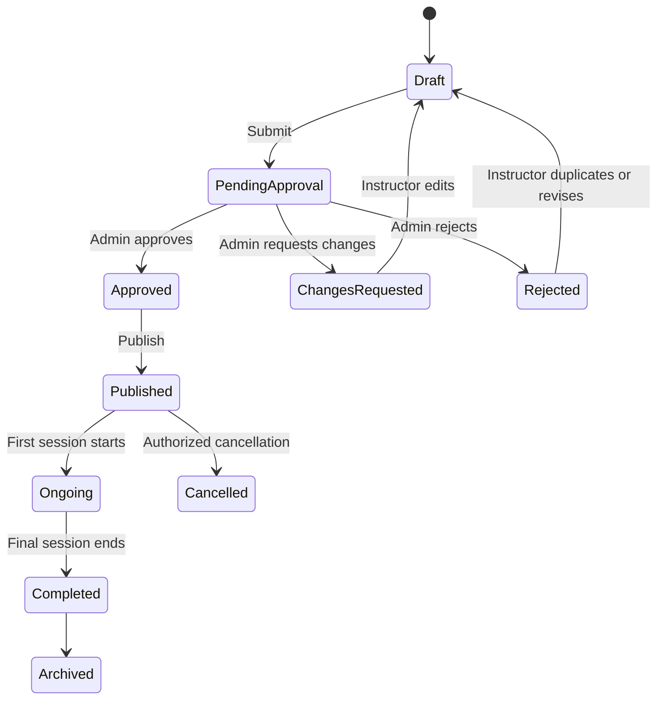

## Ariba IT: Instructor Creates Own Event — Implementation Instructions


must be check fist provus code ok ,

Implement a feature where an approved instructor can create and manage their own events. Instructor-created events must be reviewed and approved by an Admin before becoming publicly available.

### 1. Instructor eligibility

Only an instructor can create an event when:

* User account is active.
* Instructor profile is completed.
* Instructor verification status is `VERIFIED`.
* Instructor is not suspended or blocked.
* Required profile information exists:

  * Full name
  * Profile photo
  * Professional title
  * Biography
  * Expertise/categories
  * Email and phone
  * Payment/payout information, if paid events are allowed

If verification is incomplete, display:

> Your instructor profile must be verified before you can create an event.

---

## 2. Instructor menu

Add these menus to the Instructor Dashboard:

* Dashboard
* My Events

  * All Events
  * Create Event
  * Draft Events
  * Pending Approval
  * Published Events
  * Rejected Events
* Sessions
* Registrations
* Students
* Attendance
* Course Materials
* Earnings
* Payouts
* Reviews
* Notifications
* Instructor Profile

---

## 3. Event creation form

### Basic information

* Event title
* Slug—automatically generated
* Short description
* Full description
* Event category
* Event type
* Cover image
* Promotional video URL
* Training language
* Skill level:

  * Beginner
  * Intermediate
  * Advanced
  * All Levels

### Learning information

* Learning objectives
* Intended audience
* Prerequisites
* Topics covered
* Training materials included
* Certificate availability

### Delivery information

* Delivery mode:

  * Online
  * Offline
  * Hybrid
* Location, required for offline or hybrid events
* Meeting platform
* Maximum participant capacity
* Registration opening date
* Registration deadline

### Pricing

* Event type:

  * Free
  * Paid
* Regular price
* Discount price
* Discount start and end dates
* Instructor revenue percentage
* Platform commission percentage

Instructors must not directly control the platform commission. Admin configuration determines the commission.

---

## 4. Event and session relationship

One event can contain multiple sessions.

Example:

**Event:** SOC Analyst Level 1 – 3-Day Live Training

**Sessions:**

1. Session 1 – SOC Fundamentals
2. Session 2 – SIEM and Wazuh Investigation
3. Session 3 – Incident Analysis and Reporting

Each session must contain:

* Session title
* Session description
* Session date
* Start time
* End time
* Timezone
* Delivery mode
* Meeting link or physical venue
* Session order
* Instructor
* Session status

At least one valid session must exist before the event can be submitted for approval.

---

## 5. Schedule validation rules

The system must validate that:

* Session start time is earlier than end time.
* Session date is not in the past.
* Registration deadline is earlier than the first session.
* Two sessions of the same event cannot overlap.
* An instructor cannot have overlapping sessions across different events.
* Session duration must meet configured minimum and maximum limits.
* Meeting links must remain hidden from non-enrolled users.
* Meeting links become available to enrolled students according to the configured joining time.

---

## 6. Event status workflow

Use the following statuses:

| Status                | Meaning                                                   |
| --------------------- | --------------------------------------------------------- |
| `DRAFT`               | Instructor is still preparing the event                   |
| `PENDING_APPROVAL`    | Submitted to Admin                                        |
| `CHANGES_REQUESTED`   | Admin requested corrections                               |
| `APPROVED`            | Approved but not necessarily published                    |
| `PUBLISHED`           | Visible publicly and open according to registration dates |
| `REJECTED`            | Admin rejected the event                                  |
| `REGISTRATION_CLOSED` | New bookings are closed                                   |
| `ONGOING`             | One or more sessions are currently running                |
| `COMPLETED`           | All sessions have finished                                |
| `CANCELLED`           | Event was cancelled                                       |
| `ARCHIVED`            | Retained for historical records                           |

Recommended workflow:



---

## 7. Submission rules

Before allowing submission, validate:

* Event title and descriptions are completed.
* Category and language are selected.
* Cover image is uploaded.
* Learning objectives exist.
* Intended audience is defined.
* Capacity is greater than zero.
* At least one session exists.
* All schedules are valid.
* Paid events have a valid price.
* Offline events have a complete location.
* Instructor has accepted the event publishing terms.

After submission:

* Instructor cannot publish the event.
* Admin receives a notification.
* Event becomes read-only except for permitted corrections.
* Every approval action must be recorded in the audit log.

---

## 8. Admin approval process

Admin can:

* Preview the complete event.
* Review instructor information.
* Check sessions and schedule conflicts.
* Review pricing.
* Set or verify platform commission.
* Approve the event.
* Reject the event with a mandatory reason.
* Request changes with comments.
* Publish immediately.
* Schedule automatic publication.

Every rejection or requested change must include an explanation visible to the instructor.

---

## 9. Editing rules

### Draft event

Instructor can edit all fields and delete the event.

### Pending event

Instructor cannot edit or delete it unless they withdraw the submission.

### Changes requested

Instructor can edit the requested fields and resubmit.

### Published event with no registration

Instructor can request significant changes, but Admin approval is required before they become public.

### Published event with registrations

The instructor cannot directly change:

* Event date
* Session date or time
* Price
* Delivery mode
* Instructor
* Cancellation status
* Capacity below the number already registered

Such changes must be submitted as a change request to Admin. Existing students must be notified when an approved schedule or delivery change occurs.

---

## 10. Ownership and authorization

Every event must store:

* `createdBy`
* `instructorId`
* `approvedBy`
* `publishedBy`
* `createdAt`
* `updatedAt`

Business rules:

* Instructor can access only their own events.
* Admin can access all events.
* Instructor must not modify `instructorId`, approval fields, commission, or system status through the API.
* Backend authorization must enforce ownership; hiding buttons in the frontend is insufficient.
* Instructor cannot view students from another instructor’s event.
* Admin may assign a co-instructor or replace an instructor.

---

## 11. Booking rules

A student may book when:

* Event status is `PUBLISHED`.
* Registration is currently open.
* Registration deadline has not passed.
* Capacity is available.
* Student is not already registered.
* Student account is active.
* Required payment is completed.

Use a temporary seat reservation during payment to prevent overbooking.

For paid events:

* Status begins as `PAYMENT_PENDING`.
* Registration becomes `CONFIRMED` only after verified payment.
* Failed or expired payments must release the reserved seat.
* Instructor cannot manually mark an unpaid student as paid.
* Payment verification must be controlled by the payment gateway or Admin.

---

## 12. Attendance and completion

Instructor can:

* View confirmed students.
* Mark attendance for their sessions.
* Upload session resources.
* Make announcements.
* Add class notes.
* Mark a session completed.

Rules:

* Attendance is recorded separately for each session.
* Attendance history must retain who updated it and when.
* Event completion should be determined only after all required sessions are completed.
* Certificate eligibility can depend on a configured minimum attendance percentage.
* Instructor cannot change attendance after the locking period without Admin permission.

---

## 13. Cancellation and refund rules

Instructor cannot directly cancel a published event with confirmed registrations.

The instructor must submit a cancellation request containing:

* Cancellation reason
* Proposed alternative schedule
* Student impact
* Refund recommendation

Admin decides whether to:

* Reject the request
* Reschedule the event
* Transfer students
* Issue a partial refund
* Issue a full refund
* Cancel without refund when policy permits

All affected students must receive notifications.

---

## 14. Earnings rules

For paid events:

```text
Gross Revenue = Successful Payments − Refunds
Platform Commission = Gross Revenue × Commission Percentage
Instructor Earnings = Gross Revenue − Platform Commission − Applicable Charges
```

Rules:

* Instructor earnings remain `PENDING` until the event or refund window is completed.
* Refunds reduce instructor earnings.
* Instructor cannot modify transactions or payout amounts.
* Admin approves payouts.
* Maintain a complete earnings and payout ledger.

---

## 15. Notifications

Notify the instructor when:

* Event is submitted.
* Admin approves it.
* Admin requests changes.
* Admin rejects it.
* Event is published.
* A student registers.
* Payment succeeds or is refunded.
* Capacity is almost full.
* A session is approaching.
* Cancellation or rescheduling is approved.
* Earnings become available.
* A payout is processed.

Notify students about:

* Registration confirmation
* Payment confirmation
* Upcoming sessions
* Meeting link availability
* Schedule changes
* Event cancellation
* Refund status
* Certificate availability

---

## 16. Recommended database entities

* `users`
* `instructor_profiles`
* `events`
* `event_sessions`
* `event_categories`
* `event_learning_objectives`
* `event_prerequisites`
* `event_instructors`
* `event_change_requests`
* `event_approval_history`
* `registrations`
* `seat_reservations`
* `payments`
* `refunds`
* `attendance`
* `course_materials`
* `event_announcements`
* `reviews`
* `instructor_earnings`
* `payouts`
* `notifications`
* `audit_logs`

---

## 17. Critical implementation requirement

All business rules must be validated in the backend. The frontend should provide a friendly interface, but it must never be treated as the security boundary.

Use database transactions for:

* Booking and capacity updates
* Payment confirmation
* Refund processing
* Event approval
* Earnings calculation
* Event cancellation

This prevents duplicate booking, overbooking, inconsistent payments, and incorrect instructor earnings.
